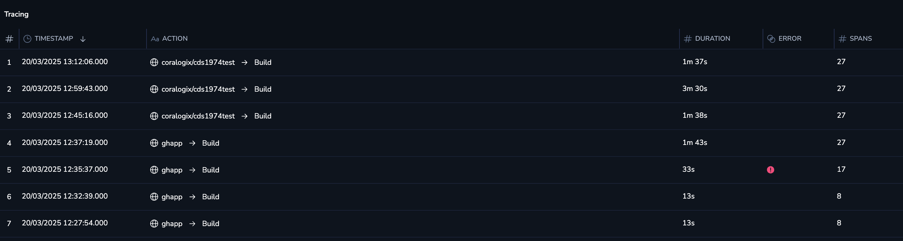
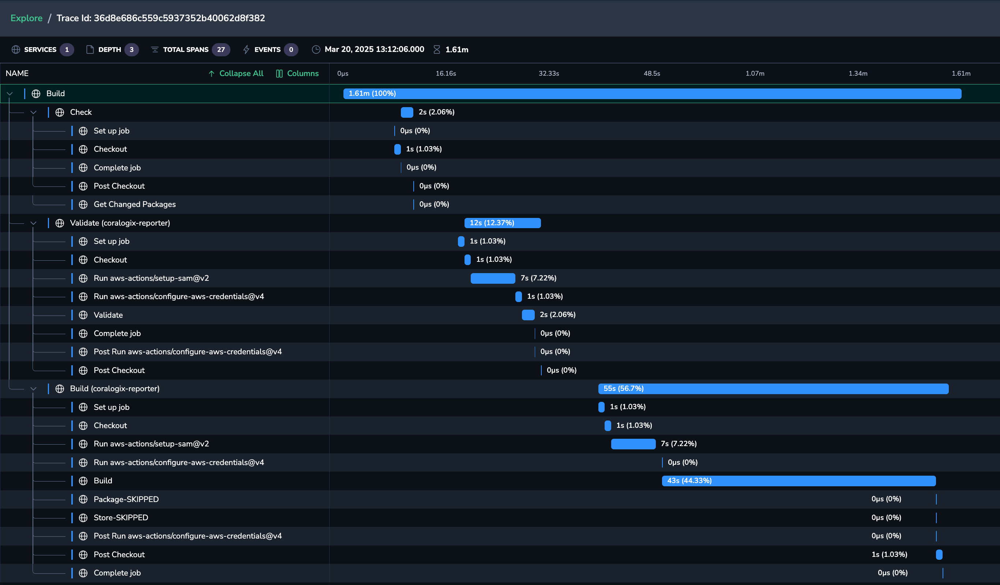
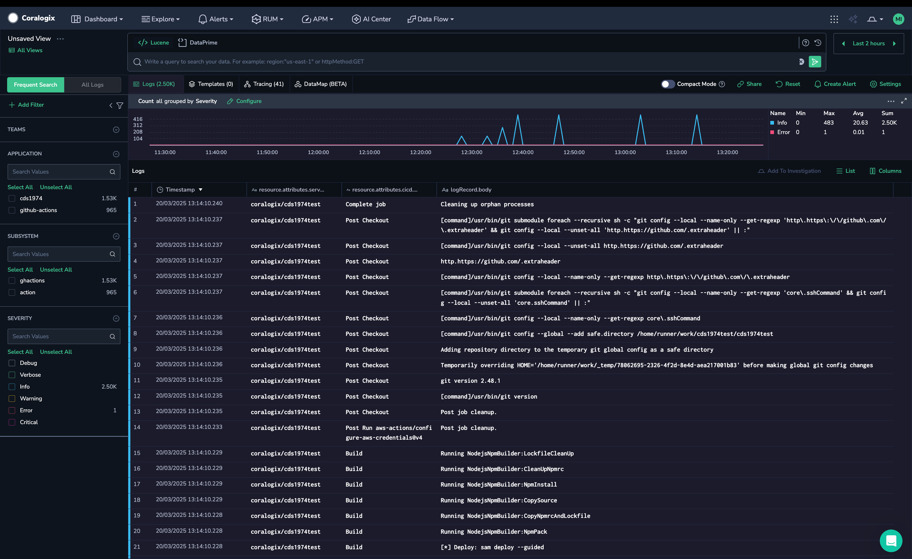
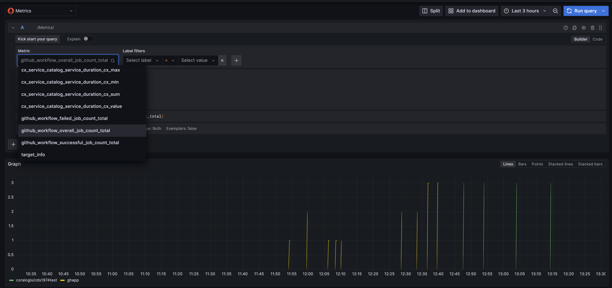

# OTLP GitHubAction Exporter

A GitHub Action to export Workflow runs as OTel Traces, Metric and Logs via OTLP.

Forked from [StephenGoodall/OTLP-GitHubAction-Exporter](https://github.com/StephenGoodall/OTLP-GitHubAction-Exporter) in order to develop and maintain it as a core part of GitHub Actions Coralogix Integration.

## Monitoring Github Actions with OTLP

This Action will allow you to monitor your Github Actions with OpenTelemetry. It works as an exporter, that will create OpenTelemetry Metrics, Logs and Traces for the steps within your GitHub Workflows. These details can then be used to analyse the performance of your CI/CD workflows.

## How-To Guides

### Configuring the OTel GitHubAction Exporter for Coralogix.

Before setting up the integration, you will need a [Coralogix Send-Your-Data API Key](https://coralogix.com/docs/user-guides/account-management/api-keys/send-your-data-api-key/).

1. Configure your Coralogix API Key as a secret in your repository, and call it `CORALOGIX_API_KEY`.
2. Configure your Coralogix OTLP Endpoint as the `OTEL_EXPORTER_OTLP_ENDPOINT` - eg. `https://ingress.coralogix.com/` or `https://ingress.eu2.coralogix.com/`. To find the OTLP Endpoint in your region, [see the endpoints doc page](https://coralogix.com/docs/integrations/coralogix-endpoints/).
3. Configure your Coralogix `OTLP_PROTOCOL` as `HTTP` (Optional as `HTTP` is the default value).
4. Configure your `OTEL_EXPORTER_OTLP_HEADERS` as `Bearer=${{ secrets.CORALOGIX_API_KEY }}` to allow it to use the secret from step 1.
5. The exporter uses automatic token authentication by default, for this you need to ensure that `GITHUB_TOKEN` has at least read access to the action scope (see example [here](OTLP-GitHubAction-Exporter.yaml.coralogix.example?plain=1#L8)).

### General Tips

Create your `workflow.yaml`, under `.github/workflows`, this can be named anything you like.
Refer to the [Coralogix Example Workflow YAML](OTLP-GitHubAction-Exporter.yaml.coralogix.example).

By having the trigger as:

```
on:
  workflow_run:
    workflows: ['*']
    types: [completed]
```

This means it will run whenever any of your other workflows complete - which means you don't need to edit any existing workflows, just put the new YAML file alongside the others in your repository.

**Note**: If you want to export to different locations, I'd recommend a single yaml file with separate jobs for each exporter - otherwise they will pick each others workflow up as a trigger.

## Required Configuration Options

`ACTION_TOKEN` - Typically ${{ secrets.GITHUB_TOKEN }} - however a PAT can be used if it has appropriate permissions

`OTEL_EXPORTER_OTLP_ENDPOINT` - This is the base endpoint URL for the OTLP Exporters. See [OpenTelemetry Docs](https://opentelemetry.io/docs/languages/sdk-configuration/otlp-exporter/#otel_exporter_otlp_endpoint)

`WORKFLOW_RUN_ID` - This contains the Workflow Run ID for the workflow that triggered this Workflow (ensure it is using the github.event context)

`WORKFLOW_RUN_NAME` - This contains the Workflow Run Name for the workflow that triggered this Workflow (ensure it is using the github.event context)

## Optional Configuration

`OTLP_PROTOCOL` - This determines the protocol to use for the Exporters (HTTP or GRPC) - Defaults to HTTP

`OTEL_EXPORTER_OTLP_HEADERS` - Technically optional, however Coralogix will need this for the Authorization. This can be used to set the Headers for the OTLP Exporter (Authorization: Bearer cxtp_......). Enter these in a commas separated, key=value format. See [OpenTelemetry Docs](https://opentelemetry.io/docs/languages/sdk-configuration/otlp-exporter/#otel_exporter_otlp_headers)

`GITHUB_DEBUG` - see [Troubleshooting](#Troubleshooting)

## Examples

Traces are viewable in the Tracing console within Coralogix. The service name will be your repository name:


Each trace can be opened to show the steps in context:


Logs will be available in the Logs console with few attributes that you can use as panel columns. Also, you have an option to use them for filtering.


Metrics will be available in the Metrics console. There are 3 metrics available:

* `github_workflow_failed_job_count_total`
* `github_workflow_overall_job_count_total`
* `github_workflow_successful_job_count_total`.

All those metrics contain the service name (i.e. repository name) label.


## Troubleshooting 

- Configure `GITHUB_DEBUG` as true in your workflow file

## Contributing

Please create an issue/PR as needed. Example configs and screenshots for other systems would be more than welcome!

## License

Coralogix GitHubAction Exporter is licensed under the [Apache 2.0](http://apache.org/licenses/LICENSE-2.0.txt) License.

Coralogix GitHubAction Exporter also use source code from third-party libraries. You can find full details on which libraries are used and the terms under which they are licensed in the [third-party notices document](THIRDPARTYLICENSES).
